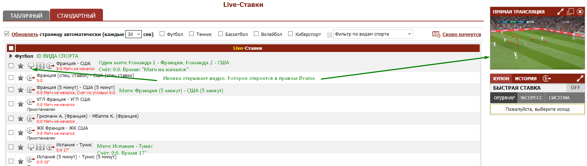
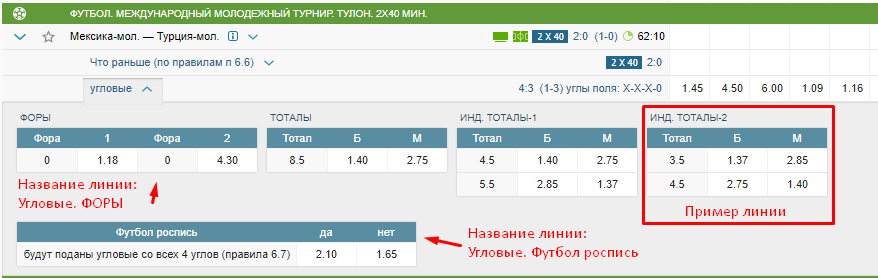
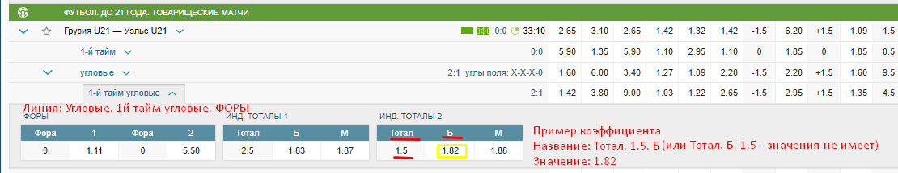
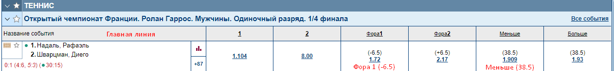
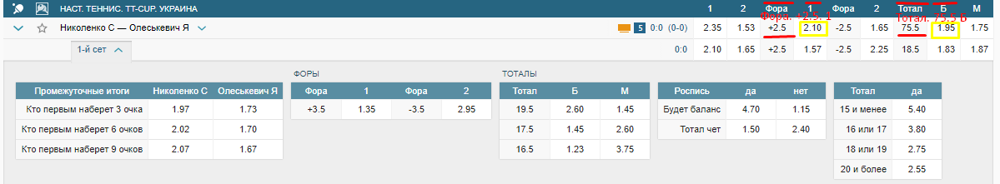
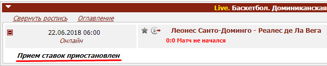

# Парсер букмекера

Мы даём шаблон парсера на C#, ссылку на букмекера, и вы пишете парсеры для двух его страниц, сверяясь с этой дорожной картой и заполняя готовую структуру в нашем формате. Простенько, чётко и прокоментированно.

Ваша задача спарсить со страницы матчей - список матчей, а со страницы конкретного матча - все линии и коэффициенты, принадлежащие этим линиям. Подробнее о линиях и кефах - в разделе ниже.

###### Установка макета парсера

    git clone git@github.com:FlameArtLab/betterparser.git ./BookmakerName/

## Букмекер

Ссылка:
[Пинекл: страница матчей](https://www.pinnacle.com/m/Mobile/ru-RU/Enhanced/Regular/TestDrive/7/NoLicense/Leagues/Soccer-29/Market/3)

> **Обратите внимание**: у Пинекла на всех страницах есть кнопка "Обновить", отсылающая XHR запрос. Парсить надо через этот запрос.

> "Родной скорости обновления" у Пинекла нет, поэтому обновлять надо раз в **5** секунд.

> Пинекл работает в FullMode (описание см. в разделе "Два возможных режима парсеров")

> `ID = 4`
`BookmakerName = Pinnacle`

##### Список матчей:
Надо пройтись по всем видам спорта с этой страницы, и в каждом виде спорта распарсить список лиг, из каждой лиги достать список матчей.

##### Конкретный матч:
Надо просто спарсить его линии и принадлежащие линиям кефы. Подробнее о линиях и кефах в разделе `Что парсить`. Пинекл - самый простой из букмекеров для такого парсинга.

## Описание парсера

Наши цели:
* **Лайв-парсер**: страница матчей и страница конкретного матча будет обновляться в цикле с родной для букмекера скоростью.
Мы хотим иметь актуальные кефы.
* **Распаршенная структура**: в результате парсинга у вас должна заполниться структура `BetterTypes.Parsed`, которую подхватит наша основная программа. Она может содержать и список матчей и список кефов.
* **Состояние**: если оно вам нужно. У нас единый экземпляр класса букмекера для всех страниц. Мы хотим спарсить ссылки на матчи, а в других потоках запускать `Start()` для каждой отдельной страницы матча из этих ссылок. Если вам надо хранить состояние, доступное для всех парсеров - смело его выносите. В init() можете его инициализировать.
* **Платформа**: `.Net Framework 4.6.1`, не `Mono` и не `Core` - они слишком медленные, а матчей единовременно может быть много и парсинг сожрёт все ресурсы.
* **Структура кода свободная**, соблюдать надо только интерфейс, который уже реализован в макете со всеми нужными структурами. А так же важна прокоментированность кода, чтобы через год разобраться в этом парсере не составило бы труда.

###### Старт
Начать надо с функции-запуска парсинга одной страницы `Start()`, которая получит первичные куки и запустит бесконечный цикл парсинга или страницы матчей или конкретного матча. Содержимое этой функции внутри - лишь пример как она должна выглядеть и какие задачи решает.

###### Роутер
Как только запрос получен - его результаты отправляются в роутер `Router()`. Задача роутера - по строке адреса запроса определить какой именно парсер этому запросу нужен, и отправить результат на парсинг в соответствующую функцию. В макете приведён пример разделения на парсер матчей `Matches()` и кефов `Kefs()` - для большинства букмекеров вам этого будет достаточно, но вы можете обрабатывать любое кол-во запросов и иметь любое кол-во парсеров - структура кода свободная. 
На роутер надо отправлять каждый полученный запрос.

> Смысл Роутера в том, чтобы иметь возможность подключить внешний браузер, который будет слать в него запросы естественным образом, а не через функцию `Start()`. Т.к. браузер вышлет ВСЕ запросы, то надо по url отделить нужные и отослать на свои парсеры. Мы подключим к роутеру внешний браузер, если обычные запросы будут приводить к слишком частым банам.

#### Макет
В макете я постарался прописать желательные механики прямо в функциях.

Все свойства в main.cs, отмеченные звёздочкой, надо заполнить вручную. ID букмекера мы выдадим сразу перед работой, кодировки, используемые конкретным букмекером, надо изучить самому и вписать.

#### Два возможных режима парсеров
Есть два режима работы букмекеров (и сайтов вообще) с лайв-данными: 
1. `[FullMode]` Одни букмекеры просто перерисовывают всю страницу и каждый раз отсылают цельный HTML или цельный JSON, 
который надо заново распарсить. Так делает, например, Olimp
   * В этом режиме надо заполнить структуру `ParsedKefs.Matches.lines` списком всех перепаршенных линий для каждого матча, если матчей в запросе пришло сразу несколько. И в каждую линию`ParsedKefs.Matches.lines[Line]` добавить соответствующие ей кефы в `ParsedKefs.Matches.lines[Line].Kefs`    
2. `[LiveMode]`Другие же высылают только изменения: кэф добавлен, изменён, удалён, заблокирован
с момента последнего запроса.
   * В этом режиме надо для каждого изменённого матча заполнить списки линий `NewLines`, `DeletedLines`, отдельно операции с кефами `NewKefs`, `UpdatedKefs`, `DeletedKefs`.
   При блокировании кефов их надо вносить в `UpdatedKefs` c отрицательными значениями `Kef.value`
   

Понятно, что режимы взаимоисключающие и в одном запросе оба быть не могут.

#### Документация `README.md`
Основа: хорошо прокоментированный код. 
Дополнительно надо написать мини-файлик, в котором описать структуру парсера и возникшие при разработке сложности.

Пример:

> Парсер кефов. При первичной загрузке, парсер должен получить на вход страницу с описанием линий:
`/linesCatalog`, что бы по ID линий получить их названия.
Затем парсер начинает периодически получать страницу `/getHTML` простыми запросами.

> В`/getHTML` DOM дерево линий, которые для разных видов спорта выглядят по-разному, всего 4 типа таблиц

#### Контроль ошибок `sendException`

Отлавливайте любым удобным способом и сразу же отправляйте их через метод `sendException [асинхронен]`. Отправляйте любое непредсказуемое поведение или содержание, если такое появилось.

## Что парсить

Нужно 2 парсера: парсер страницы матчей, и парсер страницы коэффициентов. Обе ссылки на них получите вместе с ТЗ.

Если букмекер одним запросом шлёт сразу и матчи и кефы, то на выходе надо отдать всё-равно две разные структуры.
  

### Парсер матчей `структура ParsedMatches`
Со страницы матчей надо получить *Ссылки на матчи*, *Имена команд*, *Название вида спорта*, к которому они относятся, мелкую мета инфу о счёте и времени, где она есть и если удастся добыть - ссылку на видео.

Обычно это простой табличный или json список вида Название-ссылка-вид спорта-метаинфа, виды спорта иногда вынесены в заголовок группы матчей.

## Парсер коэффициентов `структура ParsedKefs`

Важно понять, что существуют линии и коэффициенты.

> **Линия** - это минимальный цельный блок коэффициентов (например все варианты финального счёта), который имеет своё название и ID. Т.е. это раздел или категория коэффициентов

Пример линии: 

Если линия имеет несколько уровней названий, то объединить их в одну строку, разделяя ". "

>**Кефы** - это конкретные коэффициенты, которые всегда имеют название и число, иногда могут иметь доп. описание. 
Пример:`победа с форой К1 (+0.5) 2.5`. `победа с форой К1` - это название, `2.5` - это сам коэффициент, `(+0.5)` - это доп. описание, которое суммируется с названием через точку

Пример линии и коэффициента: 

На скрине слева линия фор, справа - линия `"Угловые. 1й-тайм угловые. ИНД. ТОТАЛЫ-2"`, которая содержит всего один коэффициент Тотал Б (Больше) 1.5.

> **Главная линия** - это линия в заголовке, которая обычно содержит самые популярные ставки. Спаршенные оттуда кефы вписывать в линию, так её и назвав `Line name = Line ID = "Главная линия"`

Главная линия на Марафоне

Главная линия на Фонбете

> **Заблоченные кефы и линии**

Периодически букмекеры блокируют коэффициенты, что бы их нельзя было поставить. Обычно они меняют цвет коэффициентов на серый или вообще целиком блокируют матч, как на скриншоте: 

Если букмекер блокирует весь матч, как на скриншоте, а не кефы или линии, то установить `ParsedKefs.Match.blocked = true`
Если букмекер целиком блокирует линии, ID этих линий надо записать в `ParsedKefs.blockedLines`.
Если блочит отдельные коэффициенты, то их значения `ParsedKefs.Kef.value` надо просто поменять на отрицательные.

**Важный момент:** если букмекер показал, что блочит какие-то кефы, то пишите только эти заблоченные кефы в `ParsedKefs.Kef.value`, не надо изучать всю линию на предмет заблочена ли она вся, чтобы записать в `ParsedKefs.blockedLines`, если букмекер **напрямую** эту инфу не предоставляет. Это ненужная морока для вас, а нам всё равно как кефы блочить - по конкретным ID или по всей линии.

#### Репозиторий
Для каждого парсера мы даём репозиторий на битбакете, в который надо запушить:

* Исходный код *(коммитить локально и выгрузить после оплаты)*
* Скомпилированная`dll` *(вместе с исходным кодом)*
* Документация `README.md` *(наполнять по ходу работы)*

#### Ход работы

1. Обговариваем детали, отвечаю на любые вопросы - технические, организационные, финансовые. Помогаю понять как работает тот или иной букмекер, даю советы, т.к. опыт в написании парсеров под букмекеры у меня очень большой.
    * Вы всегда можете обратится по непонятному завтыку, не стесняйтесь это делать.
2. Вы скачиваете этот макет и пишете в нём код парсера. Один проект = один букмекер.
3. Попутно комментируете код и заполняете файлик `README.md` с описанием структуры парсера и возникших сложностей
4. Мы проверяем корректность парсинга на тестере. 
    * Проект тестера открытый и подключён к этому макету: можете лично убедиться, что он выполняет строго тестовую работу
    * Вы запускаете тестер, он отдаёт на наш сервер вашу спаршенную структуру, а сервер рассылает кефы в браузеры, чтобы все могли их видеть визуально
    * *Ссылку на тестер дадим утверждённому кандидату сразу же*
5. Оставляете тестер включённым суммарно на часов 10 (можно разбить на 2 дня)
6. Артём, Паша или я в это время наблюдаем насколько кефы, матчи и линии соответствуют тем что на буках
7. Найденные в результате наблюдения ошибки кефов сообщаем и вы их фиксите
8. Если ошибок больше не остаётся, всё ок
9. Мы оплачиваем, вы пушите код на Битбакет
10. Я проверяю код с технической стороны, корректны ли механики, хватает ли комментариев к коду, вы фиксите.
